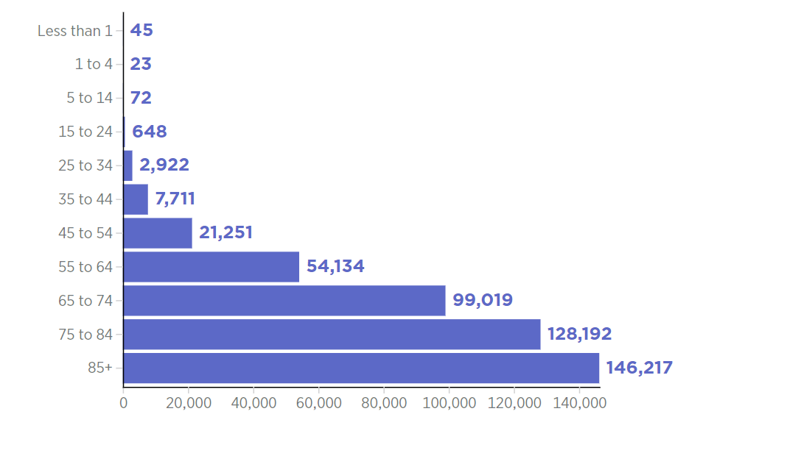
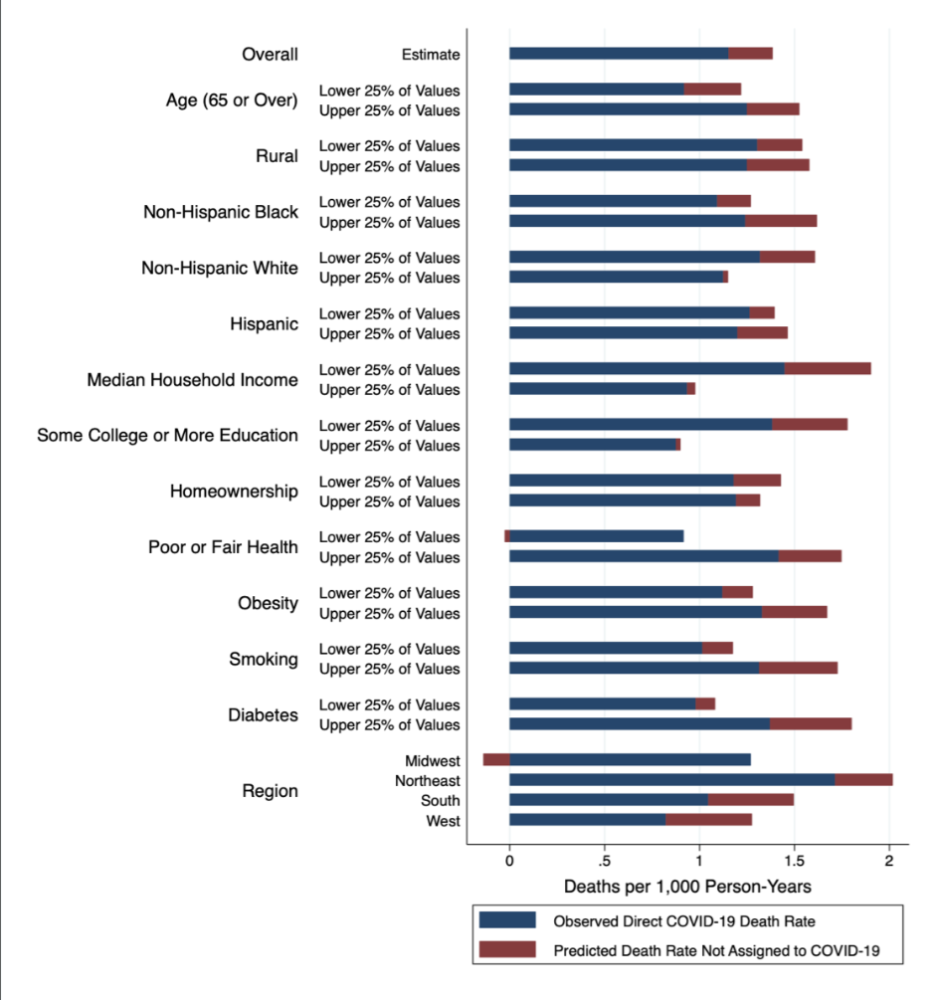

# Final plot

# Example comes from this [great blog post right here](https://blog.4dcu.be/programming/2021/05/03/Interactive-Visualizations.html) that was also used in [our test import script](https://github.com/UIUC-iSchool-DataViz/is445_bcubcg_fall2022/blob/main/week01/test_imports_week01.ipynb).

We can use a vegachart HTML tag like so:

<div>

</div>

## Search The Data & Methods


```
Our group found two contextual visualizations online, the first one is COVID-19
 Deaths by Age, which is built by a bar chart. The x-axis represents the number
 of death, and the y-axis represents the age group. The reason we chose this visualization
 is that it can help us understand which is the high-risk age group. And the other
 is COVID-19 and excess mortality in the United States: A county-level analysis.
 This visualization is akin to part of our dashboard, it not only focuses on the race
 group and region but also the physical conditions. 

```

<!-- these are written in a combo of html and liquid --> 
```
The building dashboard is based on the National Immunization Survey dataset. On the
 left side, we have the United States geographical heat map with Vaccination Rate
 Estimates of each state as values displayed in different colors. The color atla besides
 the heat map indicates that the higher Vaccination Rate Estimates value, the deeper the
 color. On the right side, we have a histogram using the Mean of Estimate as the horizontal
 axis and the Race/Ethnicity group categories. To use the dashboard, users can choose a state
 by clicking on the dropbox, and the selected state will be highlighted on the map while the
 right plot displays its Vaccina
```
<div class="left">

</div>

<div class="right">

</div>

